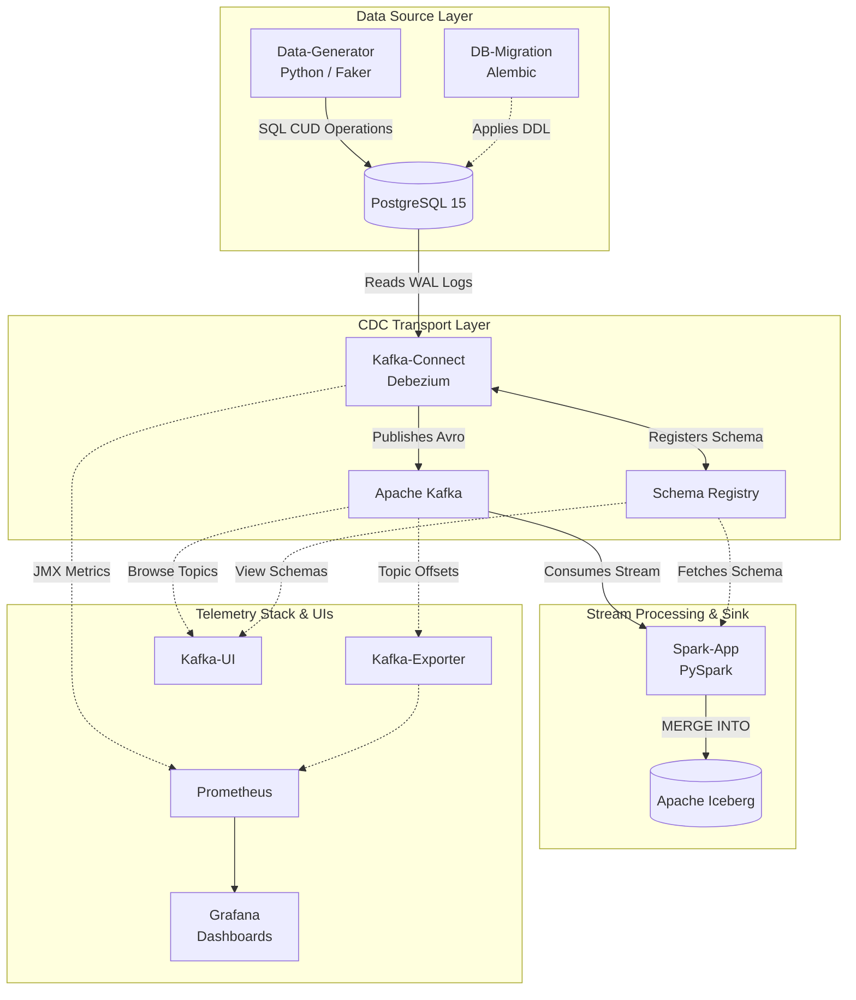
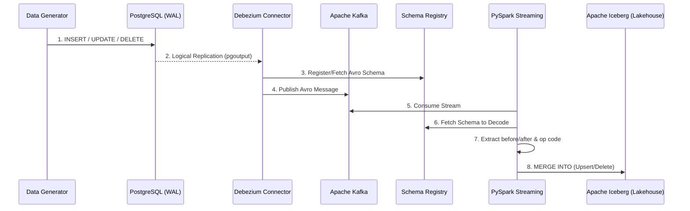

# CDC Lakehouse POC


A fully automated, 100% ephemeral **Change Data Capture (CDC)** pipeline demonstrating real-time data replication from an operational PostgreSQL database into a Data Lakehouse powered by Apache Iceberg.

This project implements the modern data stack pattern of **Log-Based CDC** using Debezium to read Postgres Write-Ahead Logs (WAL) and PySpark Structured Streaming to perform ACID-compliant `MERGE INTO` operations (Upserts/Deletes) against an Iceberg table.

## Features

* **Zero-Touch Automation:** A completely choreographed Docker Compose stack. Running `just up` spins up Kafka, migrates the DB schema, deploys the Debezium connector, generates fake data, and starts the Spark streaming job automatically.
* **100% Ephemeral Environment:** No named volumes are used. Tearing down the stack completely wipes the database and the Lakehouse, ensuring a clean slate for every POC run.
* **Log-Based CDC:** Uses `wal_level=logical` in Postgres and the `pgoutput` plugin. Debezium captures row-level changes without expensive polling.
* **Schema Registry Integration:** Uses Confluent Schema Registry to serialize Debezium payloads as compact Avro messages, natively supporting schema evolution.
* **ACID Lakehouse:** Apache Iceberg handles concurrent writes, time-travel, and schema evolution. PySpark's `foreachBatch` translates Kafka CDC events into native `MERGE INTO` queries.
* **Robust Application Timestamps:** Demonstrates application-level metadata tracking by inserting `insert_timestamp` and `update_timestamp` dynamically via a Python Fake Data Generator.
* **Full Observability Stack:** Prometheus and Grafana are bundled with auto-provisioned dashboards tracking Debezium JMX metrics and Kafka topic sizes in real-time.

## System Architecture

The pipeline orchestrates 9 Docker containers to simulate a full enterprise streaming architecture:

| Service | Technology | Description |
| :--- | :--- | :--- |
| **Source DB** | PostgreSQL 15 | Operational database generating WAL logs. |
| **Migrations** | Alembic (Python) | Ephemeral container that runs DDL schema migrations at startup. |
| **Message Broker** | Apache Kafka / ZK | Distributed streaming platform buffering CDC events. |
| **Schema Mgmt** | Confluent Schema Registry | Stores Avro schemas for data serialization and evolution. |
| **CDC Connector** | Debezium / Kafka Connect | Extracts CDC events from Postgres and publishes to Kafka. |
| **Lakehouse Processor**| PySpark 3.5.0 | Consumes Avro messages, extracts operations, and merges to Iceberg. |
| **Traffic Gen** | Python / Faker | Continuous script generating random INSERTs, UPDATEs, and DELETEs. |
| **Telemetry** | Prometheus & Grafana | Real-time monitoring of replication lag and throughput. |
| **Metrics Exporter**| Kafka Exporter | Native metrics scraping for Kafka broker topic offsets. |
| **Kafka GUI** | Provectus Kafka-UI | Web interface for managing Kafka topics and Schema Registry versions. |

### Container Architecture



### Data Flow Diagram



## Directory Structure

```text
cdc-lakehouse-poc/
├── alembic/                            # Database migration scripts
│   └── versions/                       # Schema definitions (initial schema + timestamps)
├── docker/                             # Dockerfile configurations and configs
│   ├── grafana/
│   │   ├── dashboards/                 # Auto-provisioned CDC Grafana dashboard JSON
│   │   └── provisioning/               # Grafana automated setup configs
│   ├── kafka-connect/
│   │   ├── Dockerfile                  # Custom Connect image w/ Debezium + JMX Exporter
│   │   ├── postgres-source-connector.json # Debezium REST API configuration payload
│   │   └── kafka-connect.yml           # JMX Exporter metric rules
│   └── prometheus/
│       └── prometheus.yml              # Prometheus scraping targets
├── docker-compose.yml                  # Infrastructure orchestration (9 services)
├── Justfile                            # Command runner recipes (Makefile alternative)
├── requirements.txt                    # Python dependencies for generator & alembic
├── alembic.ini                         # Alembic configuration
├── data_generator.py                   # Live traffic simulator using Faker
└── spark_app.py                        # PySpark Structured Streaming Lakehouse logic
```

## Quick Start

### Prerequisites
* **Docker Engine** & **Docker Compose (v2)**
* **Just:** A command runner. (Install via `brew install just` or `cargo install just`).

### 1. Launch the Environment
Bootstrapping the entire architecture takes exactly one command. This will download images, start databases, run migrations, deploy Debezium, and start the fake data generator:

```bash
just up

# shows below output on terminal

docker compose up -d
[+] Running 13/13
 ✔ Network cdc-lakehouse-poc_default  Created
 ✔ Container postgres                 Healthy
 ✔ Container zookeeper                Started
 ✔ Container db-migration             Started
 ✔ Container kafka                    Started
 ✔ Container schema-registry          Started
 ✔ Container kafka-exporter           Started
 ✔ Container kafka-connect            Healthy
 ✔ Container spark-app                Started
 ✔ Container prometheus               Started
 ✔ Container connector-setup          Exited
 ✔ Container data-generator           Started
 ✔ Container grafana                  Started
```

Wait ~30 seconds for all containers to reach a `Healthy` state. You can monitor the startup with:
```bash
just status

#shows below output on terminal


just status
docker ps -a
CONTAINER ID   IMAGE                                   COMMAND                  CREATED              STATUS                          PORTS                                                                                                NAMES
9e9e3986e7de   grafana/grafana:10.1.0                  "/run.sh"                About a minute ago   Up About a minute               0.0.0.0:3000->3000/tcp, [::]:3000->3000/tcp                                                          grafana
683ba2c7ae34   python:3.10-slim                        "bash -c 'pip instal…"   About a minute ago   Up About a minute                                                                                                                    data-generator
34b1d4465aaf   prom/prometheus:v2.45.0                 "/bin/prometheus --c…"   About a minute ago   Up About a minute               0.0.0.0:9090->9090/tcp, [::]:9090->9090/tcp                                                          prometheus
544e311f7f4b   curlimages/curl:8.4.0                   "/entrypoint.sh sh -…"   About a minute ago   Exited (0) About a minute ago                                                                                                        connector-setup
83fa4eff2a4c   cdc-lakehouse-poc-kafka-connect         "/etc/confluent/dock…"   About a minute ago   Up About a minute (healthy)     0.0.0.0:8080->8080/tcp, [::]:8080->8080/tcp, 0.0.0.0:8083->8083/tcp, [::]:8083->8083/tcp, 9092/tcp   kafka-connect
4e537d522d41   apache/spark:3.5.0                      "/opt/entrypoint.sh …"   About a minute ago   Up About a minute                                                                                                                    spark-app
63c4e5d0b434   confluentinc/cp-schema-registry:7.5.0   "/etc/confluent/dock…"   About a minute ago   Up About a minute               0.0.0.0:8081->8081/tcp, [::]:8081->8081/tcp                                                          schema-registry
a59b1824ea1c   danielqsj/kafka-exporter:v1.7.0         "/bin/kafka_exporter…"   About a minute ago   Up About a minute               0.0.0.0:9308->9308/tcp, [::]:9308->9308/tcp                                                          kafka-exporter
f7d771c2574c   confluentinc/cp-kafka:7.5.0             "/etc/confluent/dock…"   About a minute ago   Up About a minute               0.0.0.0:9092->9092/tcp, [::]:9092->9092/tcp                                                          kafka
6b0c2ba311a5   python:3.10-slim                        "bash -c 'pip instal…"   About a minute ago   Up About a minute                                                                                                                    db-migration
d95766b530fe   confluentinc/cp-zookeeper:7.5.0         "/etc/confluent/dock…"   About a minute ago   Up About a minute               2888/tcp, 0.0.0.0:2181->2181/tcp, [::]:2181->2181/tcp, 3888/tcp                                      zookeeper
a9722c7b304a   postgres:15-alpine                      "docker-entrypoint.s…"   About a minute ago   Up About a minute (healthy)     0.0.0.0:5432->5432/tcp, [::]:5432->5432/tcp                                                          postgres
```

### 2. Monitor Real-Time Traffic
Once running, the Data Generator continuously pushes random CUD (Create, Update, Delete) operations. 
You can tail the logs to see the pipeline in action:

```bash
# Watch the fake data being generated
docker logs -f data-generator

# shows below logs

# truncated logs

Collecting urllib3<3,>=1.21.1
  Downloading urllib3-2.8.0-py3-none-any.whl (135 kB)
     ━━━━━━━━━━━━━━━━━━━━━━━━━━━━━━━━━━━━━━━ 135.7/135.7 kB 5.2 MB/s eta 0:00:00
Collecting six>=1.5
  Downloading six-1.17.0-py2.py3-none-any.whl (11 kB)
Collecting MarkupSafe>=2.0
  Downloading markupsafe-3.0.3-cp310-cp310-manylinux2014_x86_64.manylinux_2_17_x86_64.manylinux_2_28_x86_64.whl (20 kB)
Building wheels for collected packages: pyspark
  Building wheel for pyspark (setup.py): started
  Building wheel for pyspark (setup.py): finished with status 'done'
  Created wheel for pyspark: filename=pyspark-3.5.0-py2.py3-none-any.whl size=317425403 sha256=73a9db71495baa8061774ecb1297eefcb9de3621342480ccc110e1e7809408b8
  Stored in directory: /root/.cache/pip/wheels/41/4e/10/c2cf2467f71c678cfc8a6b9ac9241e5e44a01940da8fbb17fc
Successfully built pyspark
Installing collected packages: py4j, urllib3, typing-extensions, six, pyspark, psycopg2-binary, MarkupSafe, idna, greenlet, charset-normalizer, certifi, SQLAlchemy, requests, python-dateutil, Mako, Faker, alembic
Successfully installed Faker-19.6.0 Mako-1.4.3 MarkupSafe-3.0.3 SQLAlchemy-2.0.21 alembic-1.12.0 certifi-2026.7.22 charset-normalizer-3.5.1 greenlet-3.5.6 idna-3.20 psycopg2-binary-2.9.9 py4j-0.10.9.7 pyspark-3.5.0 python-dateutil-2.9.0.post0 requests-2.31.0 six-1.17.0 typing-extensions-4.16.0 urllib3-2.8.0
WARNING: Running pip as the 'root' user can result in broken permissions and conflicting behaviour with the system package manager. It is recommended to use a virtual environment instead: https://pip.pypa.io/warnings/venv

[notice] A new release of pip is available: 23.0.1 -> 26.2.1
[notice] To update, run: pip install --upgrade pip
Waiting a few seconds before seeding to ensure connector is active...
Inserting initial seed row to trigger schema registration...
Waiting 15 seconds for Debezium to register schema and Spark to fetch it...
Starting continuous CDC stream...
INSERT: Teresa Dalton (michealcarroll@example.com)
INSERT: Michael Bryant (clarson@example.com)
INSERT: Thomas Davis (timothybeck@example.org)
INSERT: Caitlin Coleman (morrisdaniel@example.net)
UPDATE [ID 1]: Initial Seed -> new_email=robertnichols@example.com
INSERT: Anthony Guerrero (dickersonnicole@example.net)
UPDATE [ID 2]: Teresa Dalton -> new_email=lawrencestanley@example.com
INSERT: Bryan Li (rodneylong@example.org)

# truncated logs 

```

# Watch Spark processing micro-batches and writing to Iceberg
```
docker logs -f spark-app
```

### 3. Grafana Observability
The stack auto-provisions a Grafana dashboard utilizing JMX metrics from Debezium and `kafka-exporter`.
* **URL:** [http://localhost:3000](http://localhost:3000)
* **Credentials:** `admin` / `admin`
* Navigate to **Dashboards** -> **CDC Lakehouse Metrics** to monitor Replication Lag (ms) and Total Events Processed.

### 4. Web Interfaces
In addition to Grafana, you can access the following UIs to inspect the pipeline:
* **Kafka UI:** [http://localhost:8082](http://localhost:8082) - Browse Kafka topics, view live Avro messages, and inspect the Confluent Schema Registry versions.
* **Spark Web UI:** [http://localhost:4040](http://localhost:4040) - View the physical DAG, query execution plans, and micro-batch streaming statistics for the `MERGE INTO` operation.
* **Prometheus:** [http://localhost:9090](http://localhost:9090) - Query raw JMX and system metrics.

## Validating the Lakehouse (Interactive CLI)

The true test of a CDC pipeline is verifying that the Sink (Iceberg) perfectly mirrors the Source (Postgres). 

I've built custom `Justfile` recipes that dynamically execute SQL queries inside the running containers to display the latest 10 records, sorted identically by their application-level `update_timestamp` / `insert_timestamp`.

Run these commands back-to-back:

**1. Query the Source Database (PostgreSQL):**
```bash
just query-postgres
```

**2. Query the Destination Lakehouse (Apache Iceberg):**
```bash
just query-lakehouse
```
*Both queries should return nearly identical results, proving the end-to-end ACID replication is functioning with low latency.*

## How it Works: The Spark Iceberg Sink

The most complex portion of this pipeline is translating raw Debezium events (which contain `before`, `after`, and an `op` code string) into Data Lakehouse actions. 

Since Kafka topics are append-only, Spark reads the raw stream and uses `foreachBatch` to execute an Iceberg `MERGE INTO` statement on every micro-batch:

```sql
MERGE INTO local.inventory.customers t
USING (
    SELECT 
        COALESCE(after.id, before.id) as id,
        after.first_name,
        after.last_name,
        after.email,
        after.insert_timestamp,
        after.update_timestamp,
        op
    FROM cdc_microbatch
) s
ON t.id = s.id
WHEN MATCHED AND s.op = 'd' THEN DELETE
WHEN MATCHED AND s.op IN ('u', 'c') THEN UPDATE SET *
WHEN NOT MATCHED AND s.op IN ('c', 'u') THEN INSERT *
```

* **Deletes (`op='d'`):** Because the `after` payload is null on a delete event, we intelligently `COALESCE(after.id, before.id)` to extract the Primary Key and delete the corresponding row in Iceberg.
* **Updates/Inserts:** The Iceberg MOR (Merge-On-Read) table seamlessly applies new data.

## Clean Up

To completely wipe the database, Kafka topics, schema registry, and Iceberg lakehouse:
```bash
just down
```
*(Because no volumes are mounted, this returns your machine to a completely clean slate).*
