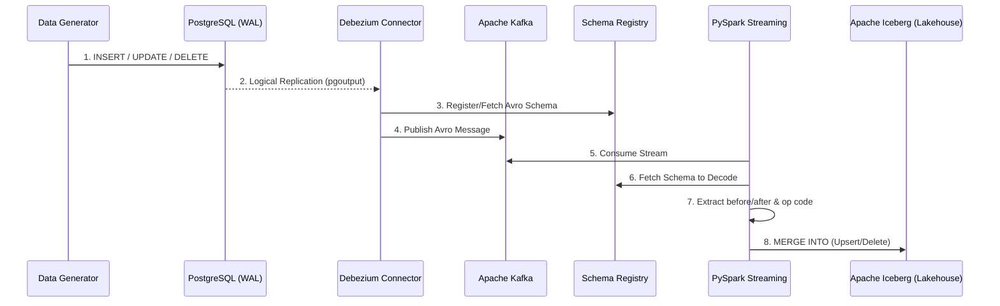

# CDC Lakehouse POC


A fully automated, 100% ephemeral **Change Data Capture (CDC)** pipeline demonstrating real-time data replication from an operational PostgreSQL database into a Data Lakehouse powered by Apache Iceberg.

This project implements the modern data stack pattern of **Log-Based CDC** using Debezium to read Postgres Write-Ahead Logs (WAL) and PySpark Structured Streaming to perform ACID-compliant `MERGE INTO` operations (Upserts/Deletes) against an Iceberg table.

## Features

* **Zero-Touch Automation:** A completely choreographed Docker Compose stack. Running `just up` spins up Kafka, migrates the DB schema, deploys the Debezium connector, generates fake data, and starts the Spark streaming job automatically.
* **100% Ephemeral Environment:** No named volumes are used. Tearing down the stack completely wipes the database and the Lakehouse, ensuring a clean slate for every POC run.
* **Log-Based CDC:** Uses `wal_level=logical` in Postgres and the `pgoutput` plugin. Debezium captures row-level changes without expensive polling.
* **Schema Registry Integration:** Uses Confluent Schema Registry to serialize Debezium payloads as compact Avro messages, natively supporting schema evolution.
* **ACID Lakehouse:** Apache Iceberg handles concurrent writes, time-travel, and schema evolution. PySpark's `foreachBatch` translates Kafka CDC events into native `MERGE INTO` queries.
* **Robust Application Timestamps:** Demonstrates application-level metadata tracking by inserting `insert_timestamp` and `update_timestamp` dynamically via a Python Fake Data Generator.
* **Full Observability Stack:** Prometheus and Grafana are bundled with auto-provisioned dashboards tracking Debezium JMX metrics and Kafka topic sizes in real-time.

## System Architecture

The pipeline orchestrates 9 Docker containers to simulate a full enterprise streaming architecture:

| Service | Technology | Description |
| :--- | :--- | :--- |
| **Source DB** | PostgreSQL 15 | Operational database generating WAL logs. |
| **Migrations** | Alembic (Python) | Ephemeral container that runs DDL schema migrations at startup. |
| **Message Broker** | Apache Kafka / ZK | Distributed streaming platform buffering CDC events. |
| **Schema Mgmt** | Confluent Schema Registry | Stores Avro schemas for data serialization and evolution. |
| **CDC Connector** | Debezium / Kafka Connect | Extracts CDC events from Postgres and publishes to Kafka. |
| **Lakehouse Processor**| PySpark 3.5.0 | Consumes Avro messages, extracts operations, and merges to Iceberg. |
| **Traffic Gen** | Python / Faker | Continuous script generating random INSERTs, UPDATEs, and DELETEs. |
| **Telemetry** | Prometheus & Grafana | Real-time monitoring of replication lag and throughput. |
| **Metrics Exporter**| Kafka Exporter | Native metrics scraping for Kafka broker topic offsets. |

### Data Flow Diagram



## Directory Structure

```text
cdc-lakehouse-poc/
├── alembic/                            # Database migration scripts
│   └── versions/                       # Schema definitions (initial schema + timestamps)
├── docker/                             # Dockerfile configurations and configs
│   ├── grafana/
│   │   ├── dashboards/                 # Auto-provisioned CDC Grafana dashboard JSON
│   │   └── provisioning/               # Grafana automated setup configs
│   ├── kafka-connect/
│   │   ├── Dockerfile                  # Custom Connect image w/ Debezium + JMX Exporter
│   │   ├── postgres-source-connector.json # Debezium REST API configuration payload
│   │   └── kafka-connect.yml           # JMX Exporter metric rules
│   └── prometheus/
│       └── prometheus.yml              # Prometheus scraping targets
├── docker-compose.yml                  # Infrastructure orchestration (9 services)
├── Justfile                            # Command runner recipes (Makefile alternative)
├── requirements.txt                    # Python dependencies for generator & alembic
├── alembic.ini                         # Alembic configuration
├── data_generator.py                   # Live traffic simulator using Faker
└── spark_app.py                        # PySpark Structured Streaming Lakehouse logic
```

## Quick Start

### Prerequisites
* **Docker Engine** & **Docker Compose (v2)**
* **Just:** A command runner. (Install via `brew install just` or `cargo install just`).

### 1. Launch the Environment
Bootstrapping the entire architecture takes exactly one command. This will download images, start databases, run migrations, deploy Debezium, and start the fake data generator:

```bash
just up
```

Wait ~30 seconds for all containers to reach a `Healthy` state. You can monitor the startup with:
```bash
just status
```

### 2. Monitor Real-Time Traffic
Once running, the Data Generator continuously pushes random CUD (Create, Update, Delete) operations. 
You can tail the logs to see the pipeline in action:

```bash
# Watch the fake data being generated
docker logs -f data-generator

# Watch Spark processing micro-batches and writing to Iceberg
docker logs -f spark-app
```

### 3. Grafana Observability
The stack auto-provisions a Grafana dashboard utilizing JMX metrics from Debezium and `kafka-exporter`.
* **URL:** [http://localhost:3000](http://localhost:3000)
* **Credentials:** `admin` / `admin`
* Navigate to **Dashboards** -> **CDC Lakehouse Metrics** to monitor Replication Lag (ms) and Total Events Processed.

## Validating the Lakehouse (Interactive CLI)

The true test of a CDC pipeline is verifying that the Sink (Iceberg) perfectly mirrors the Source (Postgres). 

I've built custom `Justfile` recipes that dynamically execute SQL queries inside the running containers to display the latest 10 records, sorted identically by their application-level `update_timestamp` / `insert_timestamp`.

Run these commands back-to-back:

**1. Query the Source Database (PostgreSQL):**
```bash
just query-postgres
```

**2. Query the Destination Lakehouse (Apache Iceberg):**
```bash
just query-lakehouse
```
*Both queries should return nearly identical results, proving the end-to-end ACID replication is functioning with low latency.*

## How it Works: The Spark Iceberg Sink

The most complex portion of this pipeline is translating raw Debezium events (which contain `before`, `after`, and an `op` code string) into Data Lakehouse actions. 

Since Kafka topics are append-only, Spark reads the raw stream and uses `foreachBatch` to execute an Iceberg `MERGE INTO` statement on every micro-batch:

```sql
MERGE INTO local.inventory.customers t
USING (
    SELECT 
        COALESCE(after.id, before.id) as id,
        after.first_name,
        after.last_name,
        after.email,
        after.insert_timestamp,
        after.update_timestamp,
        op
    FROM cdc_microbatch
) s
ON t.id = s.id
WHEN MATCHED AND s.op = 'd' THEN DELETE
WHEN MATCHED AND s.op IN ('u', 'c') THEN UPDATE SET *
WHEN NOT MATCHED AND s.op IN ('c', 'u') THEN INSERT *
```

* **Deletes (`op='d'`):** Because the `after` payload is null on a delete event, we intelligently `COALESCE(after.id, before.id)` to extract the Primary Key and delete the corresponding row in Iceberg.
* **Updates/Inserts:** The Iceberg MOR (Merge-On-Read) table seamlessly applies new data.

## Clean Up

To completely wipe the database, Kafka topics, schema registry, and Iceberg lakehouse:
```bash
just down
```
*(Because no volumes are mounted, this returns your machine to a completely clean slate).*
